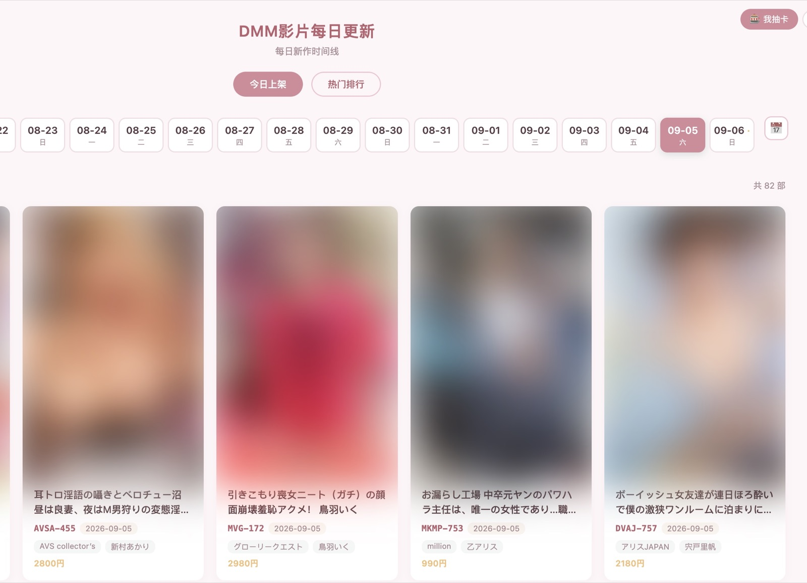

# DMM Proxy API

基于 **OpenResty (nginx + Lua)** 实现的 DMM 资源代理服务。它运行在一台能访问日本节点（如 TUN 全局代理 / 日本 VPS）的主机上，帮助客户端绕过 DMM 的地区封锁 / 403，提供封面、剧照和预告片的直链访问与视频流式转发。

> 本项目"代理"的是 DMM 官方公开的预告片与封面/剧照图床资源，列表信息本身公开可访问，这里仅充当一个不受地区限制的转发节点。

---

## 特性

- **封面 / 剧照**：`/api/cover/:id` 返回 2K 高清封面（`awsimgsrc`）、标准封面与直链及代理路径；`/api/film_sample/:id` 通过 DMM 官方 FANZA TV GraphQL API 一次性返回全部高清剧照
- **预告片**：`/api/trailer/:id` 返回多个码率预告片的直链及代理路径；探测从最高档（`hhb`/1080p）开始，只返回最高三档
- **预告片直链**：`/api/trailer_direct/:id` 并发请求 AVWikiDB / DMM / JAVDatabase，谁先成功用谁，并带 `source`；命中结果缓存 7 天（`lua_shared_dict`）
- **磁力链接聚合**：`/api/magnet/:id` 并发聚合 sukebei / javdb / javbus 三家磁力链接，结果按来源分组，可选 `?s=` 指定来源；结果按 `(来源, 番号)` 缓存 6 小时
- **播放平台探测**：`/api/findplay/:id` 并发探测 missav / supjav / jable / 123av 四个在线播放平台哪个能播放该番号，返回可跳转搜索链接与 `playable` 标识；命中缓存，未命中 1 小时（`lua_shared_dict findplay_cache`，容量由 `DMM_CACHE_TOTAL` 分配、占 2%）
- **每日更新列表**：`/api/todayupdate` 通过 DMM FANZA GraphQL API 获取每日更新的作品列表，支持按日期查询、分页
- **热门排行榜**：`/api/ranking` 按销售排名分数返回热门作品，支持分页
- **番号搜索**：`/api/search/:id` 将番号直接展开为候选数字版 content id（`maker` + 补零序号 + 常见前缀）并经 video.dmm.co.jp 的 GraphQL `ContentPageData` 探测，**无需 affiliate appid**，命中即返回完整详情；**DMM 查不到时自动用 javbus JSON API 兜底**（`source="javbus"`，返回识别码/发行日/时长/导演/制作商/发行商/类别/演员/样图等，导演缺失显示「未知」、样图走外部 CDN 避免 CORS）；大小写不敏感、忽略连字符；结果缓存 6 小时（`search_cache`，占 `DMM_CACHE_TOTAL` 的 5%）
- **会话令牌（Session Token）**：`/api/session` 签发**短时效、绑定客户端 IP** 的 token 给前端使用，主 token（`DMM_AUTH_TOKEN`）永不下发浏览器；`/api/*` 同时接受主 token 或 session token（`Authorization: Bearer`）
- **结果缓存**：todayupdate / ranking / film_sample 缓存 8 小时、search / magnet 6 小时、findplay（命中 6h / 未命中 1h）、trailer_direct 7 天；缓存内存总预算由 `DMM_CACHE_TOTAL` 按固定比例自动分配（findplay 2% / ranking 5% / search 5% / trailer 5% / todayupdate 5% / film_sample 20% / magnet 其余 58%）
- **前端浏览界面**：内置 SPA 单页应用（`/`），支持今日更新时间线、热门排行榜浏览、**番号搜索**（前端按 `source` 分支渲染 DMM / javbus 两组字段），卡片点击可弹窗预览封面与剧照大图，支持左右键盘导航；点击番号一键复制；磁力面板三源 Tab + 失败来源「重新获取」、全部无数据「重新获取」；播放平台一键跳转
- **多配色主题**：6 套小清新配色方案（薄荷绿 / 樱花粉 / 薰衣草 / 海洋蓝 / 暖杏色 / 夜猫黑），一键切换，自动保存
- **中英双语**：界面支持中文 / English 切换，自动保存偏好
- **智能 CID 探测**：番号（如 `ABP-477`）自动转成 DMM 内部多个候选 CID（如 `abp00477`、`abp0477`、`1abp477`）逐一探测，命中第一个可用项
- **快速存在性探测**：用 `Range: bytes=0-1023` 请求，接受 `200/206/416`，探测预告片由 37s 降到约 1s
- **流式视频代理**：`/proxy/video/*` 支持 HTTP Range，可在播放器内拖动进度条；自动带浏览器 UA 与 DMM 的 `Referer` 避免 CDN 403
- **可选 HTTPS (SSL)**：证书目录存在即自动启用 443；无证书则纯 HTTP，开箱即用
- **防滥用**：
  - **`/api/*`**（cover/trailer/trailer_direct/film_sample/magnet/findplay/todayupdate/ranking/search）**始终**需要 `Authorization: Bearer <token>`，token 可为主 token（`DMM_AUTH_TOKEN`）或 `/api/session` 签发的 session token
  - `DMM_API_PROTECT=on` 时，`/api/*` 返回的 `proxy.*` 附带 `DMM_SIGN_TTL` 秒内有效的 **HMAC-SHA256 签名 URL**；`/proxy/*` 需凭该签名访问，并有单 IP 限流与可选 IP 白名单
  - `DMM_API_PROTECT=off` 时，`/api/*` 返回的 `proxy.*` 为普通路径（无签名），`/proxy/*` 完全开放

---

## 界面截图

> 示例图取自本地开发环境，点击图片可查看原图。

<p align="center">
  
</p>

<p align="center">
  
</p>

<p align="center">
  
</p>

<p align="center">
  
</p>

<p align="center">
  
</p>

---

## 目录结构

```
dmm-proxy-api/
├── Dockerfile              # 基于 openresty/openresty:alpine
├── docker-compose.yml      # 一键编排，环境变量透传
├── docker-compose.hub.yml  # 从 Docker Hub 拉镜像的编排文件
├── .env                    # 本地运行配置（注意：勿提交真实 token）
├── .env.example            # 配置模板
├── api.md                  # 接口详细文档（中文）
├── api.http                # REST Client 测试请求
├── conf/
│   ├── nginx.conf          # nginx + lua 路由、代理、限流 zone（改动需 rebuild）
│   └── dmm.ssl.conf.template # HTTPS(443) server 配置模板（entrypoint 按需启用）
├── docker/entrypoint.sh    # 容器入口：检测证书，有则启用 SSL，无则纯 HTTP
├── certs/                  # 存放 SSL 证书（fullchain.pem + private.key），不入库
├── lua/                    # 业务逻辑（docker volume 挂载，改后可 reload）
│   ├── config.lua          # 配置读取、CID 转换、代理路径与签名、IP 白名单工具
│   ├── router.lua          # 鉴权 + 路由分发（check_auth，接受主 token 或 session token）
│   ├── access.lua          # gate（IP 白名单 + 限流）与 require_sig（签名校验）
│   ├── sign.lua            # HMAC-SHA256 签名 / 验签 / session token 签发校验（CDN 安全 IP 绑定）
│   ├── api_session.lua     # /api/session 实现（短时效、客户端 IP 绑定的前端 token）
│   ├── web.lua             # 基于 vendored lua-resty-http 的探测与抓取
│   ├── api_cover.lua       # /api/cover 实现
│   ├── api_film_sample.lua # /api/film_sample 实现（FANZA TV GraphQL）
│   ├── api_trailer.lua     # /api/trailer 实现
│   ├── api_trailer_direct.lua # /api/trailer_direct 实现（多源并发 + 7 天缓存）
│   ├── api_magnet.lua       # /api/magnet 实现（磁力链接聚合，多源并发 + 6 小时缓存）
│   ├── api_findplay.lua     # /api/findplay 实现（播放平台探测，多平台并发 + 缓存）
│   ├── api_todayupdate.lua # /api/todayupdate 实现（每日更新列表）
│   ├── api_ranking.lua     # /api/ranking 实现（热门排行榜）
│   ├── api_search.lua      # /api/search 实现（番号→候选 id 探测 GraphQL，无需 appid，缓存）
│   ├── api_javbus.lua      # javbus JSON API 兜底（/api/search 在 DMM 查不到番号时自动调用）
│   └── api_session.lua     # /api/session 实现（前端短时效 session token）
├── static/                 # 前端静态文件（docker volume 挂载，改后刷新即可）
│   └── index.html          # SPA 单页应用（今日更新 / 排行榜 / 主题切换 / 多语言）
└── vendor/resty/           # 本地 vendor 的 lua-resty-http（纯 Lua，无需额外依赖）
```

---

## 快速开始

### 1. 环境要求

- Docker + Docker Compose
- 宿主机可访问日本节点（用于绕过 DMM 地区封锁）。本项目开发时宿主机通过 TUN 接入日本节点，Docker 默认走宿主机网络栈，无需额外配置；若运行在日本 VPS 则天然满足。

### 2. 配置

复制 `.env.example` 为 `.env` 并填写：

```bash
cp .env.example .env
# 编辑 .env，至少修改 DMM_AUTH_TOKEN
```

### 3. 环境变量说明

| 变量 | 默认 | 说明 |
|------|------|------|
| `DMM_AUTH_TOKEN` | `change-me-in-production` | `/api/*` 的主 Bearer token，同时作为签名 URL 与 session token 的 HMAC 密钥。**只存在于服务端**，不再经 `/config.js` 注入前端。**生产必改**：`openssl rand -hex 32` |
| `DMM_API_PROTECT` | `on` | 代理侧防滥用总开关，`on/true/1/yes` 开启，`off/空` 关闭。`on` 时 `/api/*` 返回的 proxy 附带签名+时效，`/proxy/*` 需凭签名访问且有限流/IP 白名单；`off` 时 proxy 无签名、`/proxy/*` 完全开放 |
| `DMM_SIGN_TTL` | `220` | on 时签名 URL 的有效秒数 |
| `DMM_RATE_PER_MIN` | `240` | on 时单 IP 每分钟请求上限 |
| `DMM_ALLOW_IPS` | 空 | on 时可选的 IP 白名单，逗号分隔 IP 与 CIDR（如 `1.2.3.4,203.0.113.0/24`），空=放行全部 |
| `DMM_FRONTEND_TTL` | `900` | `/api/session` 签发的 session token 有效秒数（默认 15 分钟；绑定客户端 IP，过期或换 IP 即 403） |
| `DMM_CACHE_TOTAL` | `250` | 全部查询结果缓存的共享内存总预算（MB），启动时按固定比例分配（findplay 2% / ranking 5% / search 5% / trailer 5% / todayupdate 5% / film_sample 20% / magnet 58%）；非法值或 <30 回退 250 |
| `DMM_API_ID` | 内置默认 | （已停用）旧 `/api/search` 用的 DMM FANZA affiliate WebAPI ID，保留兼容 |
| `DMM_AFFILIATE_ID` | 内置默认 | （已停用）旧 affiliate ID（格式 `媒体ID-站点ID`），保留兼容 |
| `DMM_PROXY_PORT` | `80` | 宿主机对外 HTTP 端口 |
| `DMM_PROXY_SSL_PORT` | `443` | 宿主机对外 HTTPS 端口 |
| `DMM_CERT_DIR` | `/etc/ssl/dmm` | 容器内证书目录 |
| `DMM_CERT_FILE` | `fullchain.pem` | 证书文件名 |
| `DMM_CERT_KEY` | `private.key` | 私钥文件名 |

### 4. 启动

```bash
docker compose up -d --build

# 验证
curl http://localhost:8080/health    # -> ok
```

> 说明：
> - `conf/nginx.conf` 在 build 时被 COPY 进镜像，改动后需 `docker compose up -d --build`
> - `lua/` 通过 volume 挂载进容器（`./lua:/etc/openresty/lua/:ro`），改逻辑后执行 `docker compose restart`（reload worker）即可
> - `static/` 通过 volume 挂载进容器（`./static:/etc/openresty/static/:ro`），改前端文件后刷新浏览器即可，无需重启容器

### 5. 启用 HTTPS (SSL)（可选）

容器启动时 `entrypoint.sh` 会自动检测证书目录：**存在证书即启用 443，否则纯 HTTP**。无需额外开关。

**放置证书**（默认从宿主机 `./certs/` 挂载）：

```bash
mkdir -p certs
# 将证书拷贝为固定文件名（可用环境变量覆盖）
cp /path/to/fullchain.pem certs/fullchain.pem
cp /path/to/private.key   certs/private.key

docker compose up -d --build
```

**验证**：

```bash
curl -k https://localhost:8443/health   # -> ok（HTTPS 已启用）
```

证书可用以下环境变量自定义文件名与路径：

| 变量 | 默认 | 说明 |
|------|------|------|
| `DMM_SSL_CERTS_DIR` | `./certs` | 宿主机证书目录（compose 挂载源） |
| `DMM_CERT_DIR` | `/etc/ssl/dmm` | 容器内证书路径 |
| `DMM_CERT_FILE` | `fullchain.pem` | 证书文件名 |
| `DMM_CERT_KEY` | `private.key` | 私钥文件名 |

> 证书文件**最少需要** `fullchain.pem`（或证书链）与 `private.key` 两个，才会启用 HTTPS；缺任一即退回纯 HTTP。

**从 Docker Hub 拉取镜像运行**（无需本地构建）：

```bash
docker compose -f docker-compose.hub.yml up -d
```

### 6. 尝试验证

```bash
HEADER="Authorization: Bearer <你的DMM_AUTH_TOKEN>"

# 前端界面
curl -s http://localhost:8080/           # -> index.html

# 前端会话令牌（无需鉴权；浏览器前端用它调用 /api/*，主 token 不下发）
curl -s http://localhost:8080/api/session # -> {"token":"<hex>.<exp>","exp":...,"ttl":900}

# 封面
curl -s -H "$HEADER" http://localhost:8080/api/cover/SONE-128

# 剧照
curl -s -H "$HEADER" http://localhost:8080/api/film_sample/SSIS-497

# 预告片
curl -s -H "$HEADER" http://localhost:8080/api/trailer/SSIS-497

# 磁力链接聚合（全来源）
curl -s -H "$HEADER" http://localhost:8080/api/magnet/SSNI-730

# 磁力链接聚合（只查 javdb）
curl -s -H "$HEADER" "http://localhost:8080/api/magnet/SSNI-730?s=javdb"

# 播放平台探测（哪些在线播放站能播放该番号）
curl -s -H "$HEADER" http://localhost:8080/api/findplay/WAAA-321

# 每日更新列表
curl -s -H "$HEADER" http://localhost:8080/api/todayupdate

# 热门排行榜
curl -s -H "$HEADER" http://localhost:8080/api/ranking

# 番号搜索（大小写不敏感，上游统一大写）
curl -s -H "$HEADER" http://localhost:8080/api/search/abp-477
```

---

## 防护模式说明（`DMM_API_PROTECT`）

| 开关 | `/api/*` | `/proxy/*`（代理） |
|------|----------|---------------------|
| **on**（默认，推荐生产） | 需要 `Authorization: Bearer <token>`，返回的 `proxy.*` 附带 `?sig=&exp=` | **无需 token**，需 `DMM_SIGN_TTL` 内有效的**签名 URL** + 限流 + 可选 IP 白名单 |
| **off** | 需要 `Authorization: Bearer <token>`，返回的 `proxy.*` 为普通路径 | **无需 token**、无签名、不限流、无 IP 白名单 |

**on 时的签名 URL**

`/api/cover`、`/api/film_sample` 与 `/api/trailer` 返回的 `proxy.*` 字段是短时效签名链接：

```
/proxy/video/{path}?sig=<hex-hmac-sha256>&exp=<unix_ts>
```

- `exp` = 签发时间 + `DMM_SIGN_TTL`，过期即 `403`
- `sig` = `HMAC-SHA256(DMM_AUTH_TOKEN, request_uri .. ":" .. exp)`
- 即使链接泄露，也仅在 `DMM_SIGN_TTL` 秒内可用（默认 220s）

---

## API 概览

### 健康检查

```
GET /health
```
无需鉴权，返回 `ok`。

### 前端会话令牌

```
GET /api/session
```
无需鉴权。签发**短时效、绑定客户端 IP** 的 session token（形如 `<64位hex-hmac>.<exp>`，`HMAC-SHA256(secret, "frontend:"..ip..":"..exp)`，有效 `DMM_FRONTEND_TTL` 秒）。浏览器前端只用它，主 token 永不下发；`/api/*` 同时接受主 token 或 session token。IP 按 `CF-Connecting-IP` → `X-Real-IP` → `remote_addr` 取值，CDN 后依然稳定。`Cache-Control: no-store`。

### 封面 / 剧照

```
GET /api/cover/:id
Authorization: Bearer <token>
```

**响应 `200`（节选）**

```json
{
  "id": "SONE-128",
  "cid": "sone00128",
  "cover": {
    "large": "https://awsimgsrc.dmm.co.jp/pics_dig/digital/video/sone00128/sone00128pl.jpg",
    "hd": "https://awsimgsrc.dmm.co.jp/pics_dig/digital/video/sone00128/sone00128pl.jpg",
    "sd": "https://pics.dmm.co.jp/digital/video/sone00128/sone00128pl.jpg",
    "small": "https://pics.dmm.co.jp/digital/video/sone00128/sone00128pt.jpg",
    "proxy": {
      "hd": "/proxy/aws/digital/video/sone00128/sone00128pl.jpg",
      "sd": "/proxy/pics/digital/video/sone00128/sone00128pl.jpg",
      "small": "/proxy/pics/digital/video/sone00128/sone00128pt.jpg"
    }
  }
}
```

### 剧照

```
GET /api/film_sample/:id
Authorization: Bearer <token>
```

通过 DMM 官方公开的 **FANZA TV GraphQL API**（`https://api.tv.dmm.co.jp/graphql`）一次性获取该番号的全部高清剧照（无需逐个探测，且能拿到 `2K` 大图）。

**响应 `200`（节选）**

```json
{
  "id": "SSIS-497",
  "cid": "ssis00497",
  "total": 10,
  "samples": [
    {
      "index": 1,
      "small": "https://awsimgsrc.dmm.co.jp/dig_white/digital/video/ssis00497/ssis00497-1.jpg",
      "large": "https://awsimgsrc.dmm.co.jp/dig_white/digital/video/ssis00497/ssis00497jp-1.jpg",
      "proxy": "/proxy/sample/digital/video/ssis00497/ssis00497jp-1.jpg"
    }
  ]
}
```

### 预告片

```
GET /api/trailer/:id
Authorization: Bearer <token>
```

**响应 `200`（节选）**

```json
{
  "id": "SSIS-497",
  "cid": "ssis00497",
  "trailers": [
    { "quality": "sm",  "bitrate": 300,  "url": "https://cc3001.dmm.co.jp/litevideo/freepv/s/ssi/ssis00497/ssis00497_sm_w.mp4",  "proxy": "/proxy/video/litevideo/freepv/s/ssi/ssis00497/ssis00497_sm_w.mp4" },
    { "quality": "mhb", "bitrate": 2500, "url": "https://cc3001.dmm.co.jp/litevideo/freepv/s/ssi/ssis00497/ssis00497_mhb_w.mp4", "proxy": "/proxy/video/litevideo/freepv/s/ssi/ssis00497/ssis00497_mhb_w.mp4" }
  ]
}
```

> 预告片码率档位：`sm`(300k) / `dm`(1000k) / `dmb`(1500k) / `mhb`(2500k)，仅返回探测存在的档位。

### 每日更新列表

```
GET /api/todayupdate
Authorization: Bearer <token>
```

通过 DMM FANZA GraphQL API 获取每日更新的作品列表。支持按日期查询与分页。

```http
# 今日更新
GET http://localhost:8080/api/todayupdate
Authorization: Bearer <token>

# 指定日期 + 分页
GET http://localhost:8080/api/todayupdate?date=2026-09-03&limit=120&offset=0
Authorization: Bearer <token>
```

**响应 `200`（节选）**

```json
{
  "date": "2026-09-03",
  "total": 99,
  "limit": 30,
  "offset": 0,
  "hasNext": true,
  "count": 30,
  "works": [
    {
      "id": "1fns00241",
      "title": "雪国育ちの色白スレンダーBODYを性感開発する初イキッ3本番！ 柏木雫",
      "cover": { "medium": "...", "large": "..." },
      "deliveryStartAt": "2026-09-03T00:00:59+09:00",
      "actresses": [{ "id": "1112624", "name": "柏木雫" }],
      "maker": { "id": "40488", "name": "FALENO" },
      "isOnSale": true,
      "review": { "average": 5, "count": 1 },
      "releaseStatus": "LATEST_RELEASE",
      "price": { "productId": "1fns00241dl", "price": 2480, "discountPrice": null },
      "hasMultiplePrices": true,
      "sampleMovie": { "mp4": "...", "hls": "..." },
      "sampleImages": [{ "number": 1, "largeUrl": "..." }]
    }
  ]
}
```

参数：`date`(YYYY-MM-DD，默认今日 JST)、`limit`(30/60/120，默认 30)、`offset`(默认 0)。

### 热门排行榜

```
GET /api/ranking
Authorization: Bearer <token>
```

按销售排名分数返回 DMM 热门作品。每条记录包含 `rank` 排名与 `bookmarkCount` 收藏数。

```http
# 热门 Top 30
GET http://localhost:8080/api/ranking
Authorization: Bearer <token>

# 分页
GET http://localhost:8080/api/ranking?limit=60&offset=30
Authorization: Bearer <token>
```

**响应 `200`（节选）**

```json
{
  "total": 478397,
  "limit": 30,
  "offset": 0,
  "hasNext": true,
  "count": 30,
  "works": [
    {
      "rank": 1,
      "id": "sqte00683",
      "title": "いつでも使えるオナホ後輩 花守夏歩",
      "cover": { "medium": "...", "large": "..." },
      "deliveryStartAt": "2026-05-16T00:00:00+09:00",
      "actresses": [{ "id": "1099813", "name": "花守夏歩" }],
      "maker": { "id": "45414", "name": "S-Cute" },
      "isOnSale": true,
      "review": { "average": 4.94, "count": 32 },
      "releaseStatus": "SEMI_NEW_RELEASE",
      "bookmarkCount": 31336,
      "price": { "productId": "sqte00683", "price": 580, "discountPrice": 290 },
      "hasMultiplePrices": true,
      "sampleMovie": { "mp4": "...", "hls": "..." },
      "sampleImages": [{ "number": 1, "largeUrl": "..." }]
    }
  ]
}
```

参数：`limit`(30/60/120，默认 30)、`offset`(默认 0)。

### FANZA 番号搜索

```
GET /api/search/:id
Authorization: Bearer <token>
```

通过番号直接检索 DMM 数字版作品，**不依赖 affiliate appid**：番号（大小写不敏感、忽略连字符）展开为候选数字版 content id（`<maker>` + 补零序号，含 `1`/`d_`/`h_` 前缀），逐个用 video.dmm.co.jp 的 GraphQL `ContentPageData` 探测（`lua/api_content.lua`），首个命中即返回**完整详情**（简介 / 时长 / 監督 / 类型 / 剧照 / 预告 / 价格等，见 api.md §4.6）。DMM 未命中时自动用 **javbus JSON API 兜底**（`lua/api_javbus.lua`，`https://javbus-api.131433.xyz/api/movies/<番号>`，返回 識別碼 / 發行日期 / 長度 / 導演 / 製作商 / 發行商 / 系列 / 類別 / 演員 / 樣品圖像 等；导演缺失时为「未知」；样图用外部 CDN 链接避免 CORS 拦截；`source="javbus"`）。前端按 `source` 分支渲染：javbus 来源字段为纯字符串/字符串数组，DMM 来源为 `{id,name}` 对象数组；javbus 域封面被浏览器拦截时以内置占位图替代。结果按番号缓存 **6 小时**（`lua_shared_dict search_cache`，占 `DMM_CACHE_TOTAL` 的 5%），详情再以 `gc:<cid>` 缓存 7 小时。

```http
# 小写番号也能搜（上游统一大写）
GET http://localhost:8080/api/search/abp-477
Authorization: Bearer <token>
```

**响应 `200`（节选）**

```json
{
  "keyword": "ABP-477",
  "source": "graphql",
  "total": 1,
  "count": 1,
  "hits": 1,
  "limit": 1,
  "offset": 0,
  "hasNext": false,
  "works": [
    {
      "id": "ipx00685",
      "makerContentId": "IPX-685",
      "title": "...",
      "duration": { "seconds": 7440, "minutes": 124 },
      "review": { "average": 4.12, "count": 17 },
      "price": { "price": 300, "listPrice": 300, "salePrice": 300 },
      "deliveryStartAt": "2023-04-06T00:00:00Z",
      "makerReleasedAt": "2023-04-06T00:00:00Z"
    }
  ]
}
```

候选探测未命中时自动用 **javbus JSON API 兜底**（`source="javbus"`，`https://javbus-api.131433.xyz/api/movies/<番号>`，返回 識別碼/發行日期/長度/導演/製作商/發行商/系列/類別/演員/樣品圖像 等，导演缺失显示「未知」，样图使用外部 CDN 链接避免 CORS 拦截，附 `webUrl` 源站链接）。两者皆无结果时才返回 `200` 且 `works` 为空数组。

### 磁力链接聚合

```
GET /api/magnet/:id
Authorization: Bearer <token>
```

> 番号不区分大小写；响应 `200` 状态下各来源单独报错。

按番号并发聚合三个独立站点的磁力链接，结果按 `sources[]` 分组：**sukebei**（RSS，磁力由 infoHash + 官方 tracker 重建）、**javdb**（搜索页 → 详情页磁力表格）、**javbus**（搜索页 → `gid/uc` → ajax 磁力表格）。单个来源失败不影响其它来源（该来源 `count: 0` 并附 `error`）。结果按 `(来源, 番号)` 缓存 **6 小时**（`lua_shared_dict magnet_cache`，容量由 `DMM_CACHE_TOTAL` 分配、占 58%）。

```http
# 全部三个来源
GET http://localhost:8080/api/magnet/ssni-730
Authorization: Bearer <token>

# 只查 javdb（可选参数 s=，支持逗号分隔多个）
GET http://localhost:8080/api/magnet/SSNI-730?s=javdb
Authorization: Bearer <token>
```

**示例响应 `200`（节选）**

```json
{
  "code": "SSNI-730",
  "count": 25,
  "sources": [
    {
      "source": "sukebei",
      "count": 6,
      "magnets": [
        {
          "name": "SSNI-730 ...",
          "magnet": "magnet:?xt=urn:btih:1a2b...",
          "info_hash": "1a2b...",
          "size": "1.9 GiB",
          "seeders": 12,
          "leechers": 3,
          "downloads": 108,
          "category": "English Translated",
          "date": 1762843191,
          "url": "https://sukebei.nyaa.si/view/123456",
          "torrent_url": "https://sukebei.nyaa.si/download/123456.torrent"
        }
      ]
    },
    { "source": "javdb", "count": 14, "magnets": [ { "name": "...", "magnet": "...", "info_hash": "...", "size": "3.5 GB", "date": "2025-11-11", "tags": ["高清", "字幕"], "url": "https://javdb.com/v/WrBQ7" } ] },
    { "source": "javbus", "count": 5, "magnets": [ { "name": "...", "magnet": "...", "info_hash": "...", "size": "2.4 GB", "date": "2025-11-15", "url": "https://www.javbus.com/SSNI-730" } ] }
  ]
}
```

各来源磁力字段差异：`sukebei` 额外带 `seeders/leechers/downloads/category/torrent_url`；`javdb` 额外带 `tags`（如 `["高清","字幕"]）；`date` 在 sukebei 为 epoch 秒，javdb/javbus 为日期字符串。完整字段说明见 [api.md](./api.md#44-磁力链接聚合)。

参数：`s`(可选，`sukebei`/`javdb`/`javbus`，可逗号分隔，默认全部)。

### 播放平台探测

```
GET /api/findplay/:id
Authorization: Bearer <token>
```

并发探测 **missav** / **supjav** / **jable** / **123av** 四个在线播放平台哪个能播放该番号。每项返回 `url`（可跳转的搜索链接）、`playable`（可跳转标识）与 `verified`（判定可信度）。`playable: false` 时附 `error` 说明：`HTTP 403` 等状态码表示**探测被反爬拦截**（非确认无片源，失败不缓存、可稍后重试），`no result` 表示**确认该平台无片源**。番号大小写不敏感，服务端统一转大写查询。命中结果缓存 `playable: true` 6 小时、`playable: false` 1 小时（`lua_shared_dict findplay_cache`，容量由 `DMM_CACHE_TOTAL` 分配、占 2%）。完整字段说明见 [api.md](./api.md#45-播放平台探测)。

```http
GET http://localhost:8080/api/findplay/waaa-321
Authorization: Bearer <token>
```

**示例响应 `200`**

```json
{
  "code": "WAAA-321",
  "count": 4,
  "results": [
    { "platform": "missav", "label": "MissAV", "url": "https://missav.ai/en/search/WAAA-321", "playable": true, "verified": true },
    { "platform": "supjav", "label": "SupJAV", "url": "https://supjav.com/?s=WAAA-321", "playable": true, "verified": true },
    { "platform": "jable",  "label": "JableTV", "url": "https://jable.tv/search/WAAA-321/", "playable": true, "verified": true },
    { "platform": "123av",  "label": "123AV", "url": "https://123av.com/en/search?keyword=WAAA-321", "playable": true, "verified": true }
  ]
}
```

### 资源代理（`/proxy/*`）

| 路径 | 上游 | 说明 |
|------|------|------|
| `/proxy/aws/{path}` | `https://awsimgsrc.dmm.co.jp/pics_dig/{path}` | 2K 高清封面 |
| `/proxy/sample/{path}` | `https://awsimgsrc.dmm.co.jp/dig_white/{path}` | 高清剧照 |
| `/proxy/pics/{path}` | `https://pics.dmm.co.jp/{path}` | 标准图 |
| `/proxy/video/{path}` | `https://cc3001.dmm.co.jp/{path}` | 预告片视频，支持 Range |

访问 `/proxy/*` 时**无需携带 token**：
- `DMM_API_PROTECT=off` 时：直接用 `/api/*` 返回的原始 `proxy.*` 路径（无签名，完全开放）
- `DMM_API_PROTECT=on` 时：`/api/*` 返回的 `proxy.*` 已附带 `?sig=&exp=`，直接用即可；签名缺失/过期将返回 `403`

### 状态码

| 状态码 | 含义 |
|--------|------|
| `200` | 成功 |
| `206` | 部分内容（视频/图片 Range） |
| `400` | 参数缺失 |
| `401` | 缺少 `Authorization` 头（始终生效，`/api/*`） |
| `403` | token 无效；或 on 时签名无效/过期、IP 不在白名单 |
| `404` | 对应 DMM 资源未找到 |
| `429` | 超出单 IP 限流（on 时） |

---

## 工作原理

1. 客户端访问 `http://localhost:80`，nginx 返回 `static/index.html`（SPA 前端）。
2. 前端调用 `/api/session` 获取短时效 session token（主 token 全程不进入浏览器），据此调用 `/api/todayupdate`、`/api/ranking`、`/api/magnet`、`/api/findplay` 等接口。
3. 客户端请求 `/api/cover/:id`、`/api/film_sample/:id` 或 `/api/trailer/:id`，携带 Bearer token；`router.check_auth()` 校验（无论 protect 开关均强制）。
4. `config.to_cids()` 将番号转为多个候选 CID。
5. 构建响应：直接 CDN 直链 + 本机代理路径。数据来源两种：
   - **封面 / 预告片**：逐一对 DMM CDN 做 `Range: bytes=0-1023` 的快速存在性探测（`web.lua`），命中第一个可用项
   - **剧照**：通过 FANZA TV GraphQL API（`api.tv.dmm.co.jp/graphql`）一次返回该 CID 的全部剧照
   当 `DMM_API_PROTECT=on` 时，代理路径经 `sign.lua` 绑定 `HMAC-SHA256(token, uri..":"..exp)` 签名并附 `exp`。
6. 客户端访问 `/proxy/*` 时（**无需 token**）：
   - `access.gate()`：on 时执行 IP 白名单 + 固定窗口限流（`ngx.shared.rate_limit`）
   - `access.require_sig()`：on 时校验签名与过期时间；off 时放行
7. nginx `proxy_pass` 转发到对应 DMM CDN，视频流关闭缓冲（支持拖动），图片按需转发。
8. 容器启动时 `entrypoint.sh` 检测证书：证书存在则额外启用 HTTPS(443) server 块（`include dmm.d/ssl.conf`），否则仅监听 HTTP(80)。

### 签名校验细节（`sign.lua`）

- 签名消息 = `request_uri .. ":" .. exp`，密钥 = `DMM_AUTH_TOKEN`
- 采用 **OpenResty 内置 `resty.openssl.hmac`**（`ngx.hmac_sha256` 在部分镜像不可用），输出 `resty.string.to_hex`
- 常量时间比较，防止时序侧信道
- `exp` 必须未过期，否则拒绝

---

## 指纹/调试建议

- 查看访问日志：`docker exec dmm-proxy tail -f /var/log/openresty/access.log`
- 查看错误/限流日志：`docker exec dmm-proxy tail -f /var/log/openresty/error.log`
- 检查 nginx 配置：`docker exec dmm-proxy /usr/local/openresty/bin/openresty -t`

---

## 安全提醒

- **生产必备**：设置强 `DMM_AUTH_TOKEN`（`openssl rand -hex 32`），并用 `DMM_ALLOW_IPS` 收紧到可信来源；把 `DMM_API_PROTECT` 保持为 `on`
- `DMM_API_PROTECT=off` 仅用于内网/调试环境——此时 `/proxy/*` 完全开放（无签名、无限流），链接一旦泄露可被任意转发
- `/health` 无鉴权，不返回敏感信息，可安全暴露

---

## 前端界面

访问 `http://localhost:80` 即可打开内置的 SPA 浏览界面。

### 功能

| 功能 | 说明 |
|------|------|
| **今日更新** | 7 天时间线选择器，点击日期查看当日上架作品 |
| **热门排行** | 按 DMM 销量排名展示热门作品，含排名序号与收藏数 |
| **卡片浏览** | 5 列网格布局，展示封面、标题、演员、商家、价格、评分 |
| **图片预览** | 点击卡片弹出大图弹窗，依次展示封面 + 全部剧照，左右箭头 / 键盘 `←` `→` 切换，`Esc` 关闭 |
| **配色主题** | 6 套小清新风格：薄荷绿 / 樱花粉 / 薰衣草 / 海洋蓝 / 暖杏色 / 夜猫黑，右上角 🎨 切换 |
| **中英双语** | 右上角按钮切换中文 / English，偏好自动保存到 `localStorage` |
| **分页** | 每页 30 条，支持翻页浏览 |
| **Mock 降级** | API 不可用时自动使用内置 mock 数据，界面仍可正常浏览 |

### Token 机制

- **主 token**（`DMM_AUTH_TOKEN`）：服务端专用，供脚本/集成调用，也可用于 `/api/*` 的 `Authorization: Bearer`。
- **session token**（`/api/session` 签发）：前端唯一持有的 token——短时效（`DMM_FRONTEND_TTL`，默认 15 分钟）、绑定客户端 IP，过期或换 IP 即 `403`；前端在将过期或收到 `401/403` 时自动重新签发。即使从 DevTools 抄走，也无法长期复用，更不会泄露主密钥。
- `/api/*` 的 `router.check_auth()` 两者都接受。

### 文件说明

| 文件 | 说明 |
|------|------|
| `static/index.html` | 单文件 SPA，包含 HTML / CSS / JS，零依赖 |
| `GET /api/session` | 签发前端 session token（无需鉴权，由 nginx Lua 处理） |

> `static/` 通过 volume 挂载，修改后刷新浏览器即可，无需重建容器。

---

## 常见问题

**为什么 `/api/*` 在 on/off 模式下都要 token，而 `/proxy/*` 不用？**
这是刻意设计：`/api/*` 是"按番号探测并生成链接"的入口，**始终强制 token**，防止被匿名滥用（盗刷探测流量）；`/proxy/*` 则面向播放器/图片直连，不要求 token——`on` 时仅靠短时效签名（`sig`+`exp`）保护，`off` 时完全开放。

**改 nginx.conf 后不生效？**
`conf/nginx.conf` 在 build 时 COPY 进镜像，改动后需 `docker compose up -d --build`。改 `lua/*.lua` 则只需 `docker compose restart`。

**某番号返回 404？**
可能确实无对应资源（无预告片/封面命名特殊），或 CID 探测未命中全部变体。可检查 error.log 确认探测请求。

**视频播放卡顿/无法拖动？**
确认请求带了 `Range` 头并获得 `206`；`/proxy/video/*` 已关闭缓冲（`proxy_buffering off`）、`proxy_read_timeout 120s`。

**为什么 HTTPS 没生效？**
`entrypoint.sh` 要求 `/etc/ssl/dmm/` 下同时存在 `fullchain.pem` 与 `private.key` 才开始监听 443。检查：① 证书是否已放入宿主机 `./certs/`；② `docker logs dmm-proxy` 是否显示 `SSL enabled`；③ 证书文件是否有读取权限。
